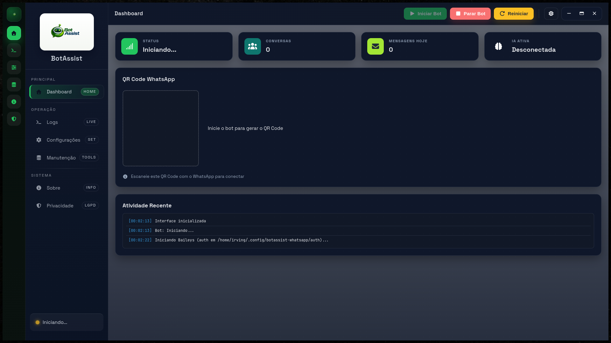

# BotAssist WhatsApp

[](LICENSE)
[](https://github.com/N1ghthill/botassist-whatsapp/releases)
[](https://github.com/N1ghthill/botassist-whatsapp/issues)
[](https://github.com/N1ghthill/botassist-whatsapp/pulls)
[](https://github.com/sponsors/N1ghthill)

Bot de WhatsApp com interface gráfica (Electron), conexão via Baileys e respostas com IA (Groq).

**Créditos**

- Desenvolvido por Irving Ruas — `ruas.dev.br`

Links rápidos:

- 🌐 Site: `https://botassist.ruas.dev.br` (landing page)
- 📦 Downloads (Releases): `https://github.com/N1ghthill/botassist-whatsapp/releases/latest`
- 🐛 Issues: `https://github.com/N1ghthill/botassist-whatsapp/issues`
- 🤝 Contribuir: `CONTRIBUTING.md`
- ☕ Doar: `https://github.com/sponsors/N1ghthill`

## 🧭 Índice

- [✨ Funcionalidades](#funcionalidades)
- [🏗️ Arquitetura (Electron)](#arquitetura-electron)
- [✅ Requisitos](#requisitos)
- [📦 Instalação](#instalacao)
- [▶️ Executar em desenvolvimento](#executar-em-desenvolvimento)
- [⚙️ Configuração](#configuracao)
- [🛡️ Segurança (anti-ban)](#seguranca-anti-ban)
- [🧰 Manutenção (backup/reset)](#manutencao-backupreset)
- [📦 Build (empacotar)](#build-empacotar)
- [🚀 Release (auto-update)](#release-auto-update)
- [🤝 Contribuindo](#contribuindo)
- [📜 Licença](#licenca)
- [🛰️ Telemetria / rastreamento](#telemetria--rastreamento)

<a id="licenca"></a>

## Licença

Este projeto é **software livre** e está licenciado sob a **MIT License**.

- Você pode usar, modificar e redistribuir (inclusive comercialmente), desde que mantenha o aviso de copyright e a licença.
- **Sem garantias**: você usa por sua conta e risco (o texto completo está em `LICENSE`).

## Docs

- `docs/INDEX.md`
- `docs/GUIA-RAPIDO.md`
- `docs/CONFIGURACAO.md`
- `docs/ATUALIZACOES.md`
- `docs/NOTAS-DA-VERSAO.md`
- `docs/notas-da-versao.json`
- `docs/ORGANIZACAO-REPO.md`
- `docs/FAQ.md`
- `docs/MODULOS.md`
- `docs/TOOLS.md`
- `docs/SEGURANCA.md`
- `docs/ARQUITETURA.md`
- `docs/RELEASE-CHECKLIST.md`
- `docs/RECURSOS.md`
- `docs/TROUBLESHOOTING.md`
- `docs/CONTRIBUICAO-DOCS.md`

<a id="funcionalidades"></a>

## ✨ Funcionalidades

- Interface gráfica para iniciar/parar o bot, ver logs e QR Code
- Configurações persistentes com **perfis (agentes)**, prompt principal e modelo
- Perfis com **criar/duplicar/excluir** e **importar/exportar**
- Modo anti-ban para grupos:
  - Só responde **quando mencionado**
  - Só responde em **grupos allowlistados**
  - Cooldown por chat (DM/grupo) e limite de tamanho da resposta
- Respostas com IA via Groq (opcional; sem API Key ele avisa como configurar)
- Ferramentas (tools) opt-in com aprovacao do owner
- Contexto situacional nativo no prompt (data/hora, SO e diretorio de trabalho)
- Busca web via `web.search` (DuckDuckGo Instant API)
- Leitura de paginas via `web.open` com filtros de dominio

## Novidades recentes

- Veja `docs/NOTAS-DA-VERSAO.md` para resumo editorial da release.
- Para automacao no site/app, use `docs/notas-da-versao.json`.

<a id="arquitetura-electron"></a>

## 🏗️ Arquitetura (Electron)

O app tem 3 camadas:

- `src/main.js`: processo principal do Electron (cria janela, gerencia settings, sobe o bot como processo filho)
- `src/preload.js`: ponte segura (expõe `window.electronAPI` para o renderer via `contextBridge`)
- `src/renderer/*`: UI (HTML/CSS/JS)

O bot roda separado em:

- `src/core/bot.js`: processo Node do bot (Baileys + Groq), emitindo eventos para a UI via **IPC** (`process.send`) com fallback via stdout (`BOTASSIST:{...}`).

<a id="requisitos"></a>

## ✅ Requisitos

- Node.js (recomendado: versão LTS)
- NPM

<a id="instalacao"></a>

## 📦 Instalação

```bash
npm ci
```

## ⚡ Comece em 5 minutos

1. Abra o app e cole sua API Key da Groq.
2. Clique em "Salvar Configuracoes".
3. Inicie o bot e escaneie o QR Code.

Criar chave: https://groq.com/




### Dependência nativa (keytar)

O app usa `keytar` para armazenar a API Key da Groq de forma segura no sistema (Keychain/Secret Service/Credential Manager).

Em alguns ambientes pode ser necessário rebuildar o módulo nativo para o Electron:

```bash
npx electron-builder install-app-deps
```

<a id="executar-em-desenvolvimento"></a>

## ▶️ Executar em desenvolvimento

```bash
npm run dev
```

<a id="configuracao"></a>

## ⚙️ Configuração

As configurações são salvas em `settings.json` dentro do `userData` do Electron (`app.getPath('userData')`).

Principais campos:

- `profiles`: lista de perfis (agentes). Cada perfil possui:
  - `id`: identificador interno
  - `name`: nome do agente
  - `provider`: `groq` (único)
  - `model`: ex. `llama-3.3-70b-versatile` (há um menu com modelos gratuitos na UI)
  - `systemPrompt`: instrucao principal do agente
  - `botTag`: prefixo nas respostas (ex.: `[Meu Bot]`)
- `activeProfileId`: id do perfil ativo
- `persona` (legado): mantido por compatibilidade, mas a UI usa perfis
- A UI permite **criar/duplicar/excluir** e **importar/exportar** perfis
- `apiKeyRef`: referência de onde a API Key está armazenada:
  - `keytar:groq_apiKey` (recomendado; a chave fica no sistema via `keytar`)
  - `settings.json` (fallback; a chave pode ser persistida no arquivo se o keychain não estiver disponível)
- `systemPrompt`: instrucoes adicionais (extras) do sistema
- `restrictToOwner`: so responde ao owner
- `allowedUsers`: allowlist de usuários (um por linha; telefone ou JID)
- `respondToGroups`: habilita respostas em grupos
- `allowedGroups`: allowlist de grupos (JIDs `...@g.us`)
- `profileRouting`: roteamento por perfil (usuarios/grupos normalizados automaticamente)
- `cooldownSecondsDm` / `cooldownSecondsGroup`: cooldown por chat
- `maxResponseChars`: limita o tamanho da resposta

### API Key (Groq)

- Configure pela UI. A chave não fica exposta no `settings.json` quando `keytar` está disponível.
- Alternativa: defina `GROQ_API_KEY` no ambiente.
- Link rapido: https://groq.com/ (crie a API Key e cole na tela de Configuracoes).

### Como pegar o JID do grupo (para allowlist)

No grupo, mencione o bot e envie:

```text
!groupid
```

Ele responde com o JID do grupo para você colar em “Allowlist de grupos”.

<a id="seguranca-anti-ban"></a>

## 🛡️ Segurança (anti-ban)

Mesmo com “Responder em grupos” ativo, o bot:

- **ignora mensagens em grupo sem menção**
- **ignora grupos fora da allowlist**

Opcionalmente você pode ativar “somente comandos” em grupos: `@bot !ajuda ...`.

<a id="manutencao-backupreset"></a>

## 🧰 Manutenção (backup/reset)

No app, a aba **Manutenção** permite:

- Criar **backup** dos dados locais (`userData`)
- Abrir a pasta de dados
- Resetar sessão (forçar novo QR Code)
- Limpar memória das conversas (histórico/summaries)

<a id="build-empacotar"></a>

## 📦 Build (empacotar)

```bash
npm run build:win
npm run build:mac
npm run build:linux
npm run build:linux:appimage
npm run build:linux:rpm
```

### Observações

- Windows: pode exigir executar no Windows, ou Linux com Wine configurado.
- macOS: recomenda-se gerar no macOS (assinatura/notarização e DMG).
- Linux: `build:linux` tenta gerar `AppImage` + `.deb`; `build:linux:rpm` gera `.rpm`. Para usuários finais, recomende `.deb` (Ubuntu/Debian) ou `.rpm` (Fedora/openSUSE); `AppImage` fica como alternativa portátil.
- Linux (somente AppImage): use `build:linux:appimage` para um artefato portátil sem gerar `.deb`.
- Fedora 40+ (host local): se o `.deb` falhar com `libcrypt.so.1`, o `build:linux` faz fallback automático para `AppImage`; para voltar a gerar `.deb`, instale `libxcrypt-compat`.

<a id="release-auto-update"></a>

## Release (auto-update)

Para publicar builds e habilitar auto-update, use o workflow do GitHub Actions:

- Suba a versao no `package.json`, crie uma tag `vX.Y.Z` e de push. Detalhes em `docs/ATUALIZACOES.md`.

## Troubleshooting

- Se o QR não aparecer: verifique os logs e se o bot está iniciando.
- Se o setup inicial não abrir: conclua API Key/owner em `Configurações`.
- Se precisar gerar novo QR/sessão: apague a pasta `auth` dentro do `userData`.
- Se a IA não responder: configure a API Key pela UI (armazenada via `keytar`) ou defina `GROQ_API_KEY`.

<a id="contribuindo"></a>

## 🤝 Contribuindo

Contribuições são muito bem-vindas — o objetivo é colaborar com software livre, gratuito e de qualidade.

Guia rápido: `CONTRIBUTING.md`.

<a id="telemetria--rastreamento"></a>

## 🛰️ Telemetria / rastreamento

Este app não inclui analytics/pixels/telemetria por padrão.

- O que pode existir são **logs técnicos do provedor** no GitHub (ex.: downloads/requests) e logs locais do app para operação normal.
