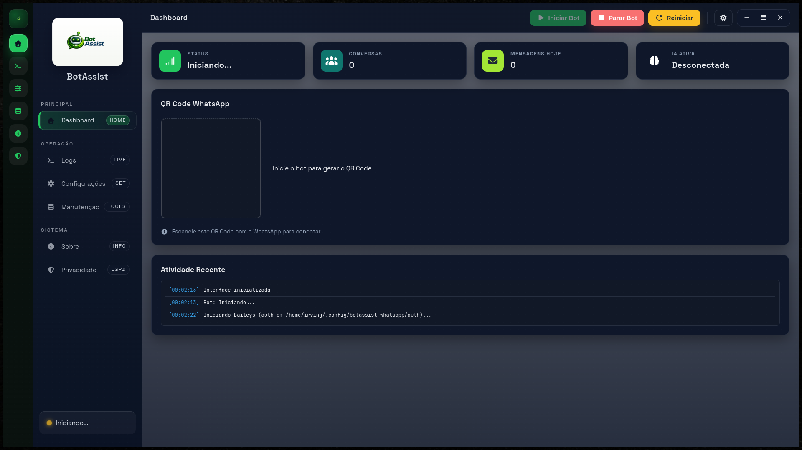
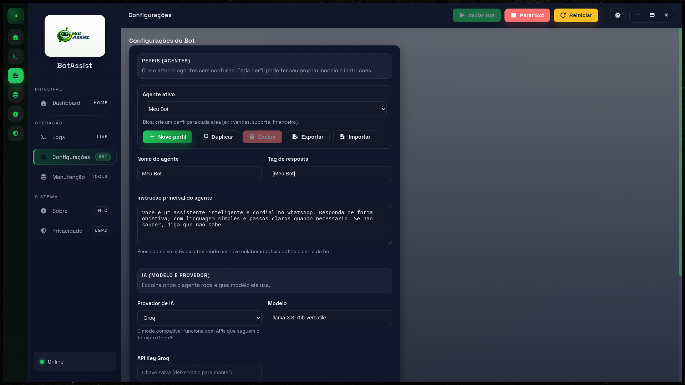
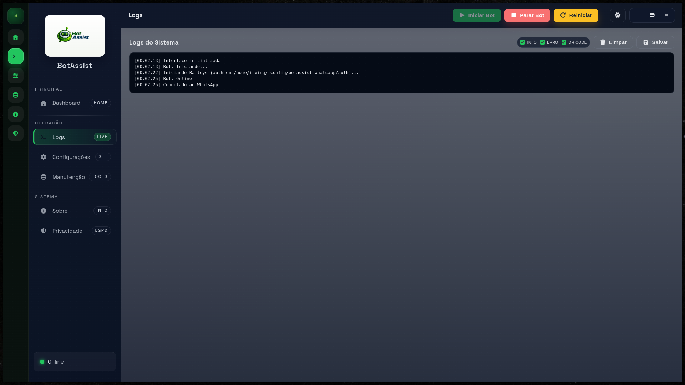

# BotAssist WhatsApp

[](LICENSE)
[](https://github.com/N1ghthill/botassist-whatsapp/releases)
[](https://github.com/N1ghthill/botassist-whatsapp/issues)
[](https://github.com/N1ghthill/botassist-whatsapp/pulls)

Aplicativo desktop em Electron para operar um bot de WhatsApp com IA, perfis, onboarding guiado e tools opt-in com politicas de seguranca.

Desenvolvido por Irving Ruas em `ruas.dev.br`.

## Visao geral

O BotAssist nasceu como um app pessoal, mas hoje a proposta do repo e mais clara:

- instalar e operar um bot de WhatsApp localmente, com interface grafica
- configurar o bot sem editar JSON manualmente
- trabalhar com perfis/agentes diferentes no mesmo app
- controlar tools locais com owner, aprovacao e trilha de auditoria
- publicar builds com auto-update e fluxo de release previsivel

## O que o app entrega

- Dashboard com start/stop/restart, status do bot, logs e QR Code
- Setup inicial guiado para API key, modelo, conexao e owner por token
- Perfis com criar, duplicar, excluir, importar e exportar
- Roteamento de perfis por usuario e por grupo
- Ferramentas opt-in para web, arquivos, shell e email
- Politicas de acesso para grupos, allowlists, cooldown e tamanho maximo de resposta
- `shell.exec` com allowlist/denylist por comando-base, sem shell intermediario, sem override de ambiente e sem path explicito quando a allowlist estiver ativa
- Persistencia de configuracao com `keytar` quando disponivel
- Auto-update via GitHub Releases para `stable`, `beta` e `rc`

## Estado atual

- Linha publicada no repo: `4.2.4`
- Release estavel ativa: `v4.2.4`
- `v4.2.4` publicada com assets para Windows, macOS e Linux e verificada com `npm run release:verify -- --tag v4.2.4`

## Comece em 5 minutos

1. Instale as dependencias com `npm ci`.
2. Rode o app com `npm run dev` para desenvolvimento ou use uma build empacotada.
3. Cole sua API key da Groq em `Configuracoes`.
4. Inicie o bot e escaneie o QR Code.
5. Gere um token de owner no app.
6. No DM do bot, envie `!owner <token>`.

Criar chave: `https://groq.com/`

## Fluxo operacional

1. O app Electron sobe a interface e gerencia `settings`, updates e ciclo do bot.
2. O bot roda em `utilityProcess` separado com Baileys + provider de IA.
3. O renderer conversa com o processo principal via `preload` seguro.
4. Quando tools estao habilitadas, o provider pode pedir execucao de acoes dentro das politicas configuradas.
5. A UI recebe logs, status, QR Code, updates e sincronizacao de configuracao em tempo real.

## Ferramentas

As tools sao opt-in. O subsistema atual foi reorganizado para separar:

- catalogo unico de tools
- politicas de acesso e aprovacao
- orquestracao do loop com o provider
- executores por dominio

Hoje o app suporta:

- `web.search`
- `web.open`
- `fs.list`
- `fs.read`
- `fs.write`
- `fs.delete`
- `fs.move`
- `fs.copy`
- `shell.exec`
- `email.read`

Por padrao, operacoes mutaveis, `shell.exec` e `email.read` ficam no fluxo de aprovacao por owner.

## Seguranca

- Owner e definido pelo metodo recomendado de token via WhatsApp
- Em grupos, o bot pode operar com mencao obrigatoria e allowlist
- Tools usam validacao de path, dominio, extensao e limites de tamanho
- Escrita/remocao so funcionam com `allowedWritePaths` explicito; vazio significa bloqueado
- Acoes de tools geram auditoria local em `userData/logs/tools_audit.log`
- `keytar` e usado para segredos quando o ambiente permite
- O binario empacotado usa fuses do Electron para desativar `RunAsNode`, bloquear `NODE_OPTIONS`/`--inspect` e exigir carga por `app.asar` com validacao de integridade
- O renderer empacotado carrega por `app://botassist/*`, sem depender de `file://`
- Links externos abrem no navegador padrao e navegacoes inesperadas sao bloqueadas no `BrowserWindow`

## Requisitos

- Windows 10 ou superior
- macOS 12 (Monterey) ou superior
- Linux x64 moderno
- Node.js 22 LTS recomendado para desenvolvimento local
- npm

Em alguns ambientes pode ser necessario rebuildar modulos nativos para o Electron:

```bash
npx electron-builder install-app-deps
```

## Desenvolvimento

Instalacao:

```bash
npm ci
```

Executar em desenvolvimento:

```bash
npm run dev
```

Validacoes locais:

```bash
npm test
npm run lint
npm run release:notes -- --tag vX.Y.Z --title-only
npm run release:verify -- --tag vX.Y.Z
```

Governanca de CI:

- workflows versionados usam GitHub Actions pinadas por commit SHA
- comentarios `# vN` ao lado do SHA preservam a major de referencia para o Dependabot
- PRs de update de actions so devem ser mergeados com CI/release verdes

Builds:

```bash
npm run build:win
npm run build:mac
npm run build:linux
npm run build:linux:appimage
npm run build:linux:rpm
npm run build:linux:dir
npm run smoke:packaged
```

## Releases

O projeto agora separa canais:

- `vX.Y.Z`: stable
- `vX.Y.Z-beta.N`: beta
- `vX.Y.Z-rc.N`: release candidate

O updater segue o mesmo canal da versao instalada. O processo operacional esta em [docs/ATUALIZACOES.md](docs/ATUALIZACOES.md), a checklist em [docs/RELEASE-CHECKLIST.md](docs/RELEASE-CHECKLIST.md) e a verificacao pos-publicacao usa `npm run release:verify`.

## Capturas







## Documentacao

Comece por:

- [docs/INDEX.md](docs/INDEX.md)
- [docs/GUIA-RAPIDO.md](docs/GUIA-RAPIDO.md)
- [docs/CONFIGURACAO.md](docs/CONFIGURACAO.md)
- [docs/ARQUITETURA.md](docs/ARQUITETURA.md)
- [docs/ASSINATURA-E-NOTARIZACAO.md](docs/ASSINATURA-E-NOTARIZACAO.md)
- [docs/NOTAS-DA-VERSAO.md](docs/NOTAS-DA-VERSAO.md)

## Troubleshooting rapido

- Sem QR Code: confira logs e status do bot
- Sem resposta da IA: verifique API key e modelo
- Sem owner: gere novo token e envie `!owner <token>` no DM
- Problemas com sessao: resete a sessao na aba de manutencao
- Problemas de update: confirme o canal e o feed Linux correspondente

## Contribuicao

As contribuicoes sao bem-vindas. O melhor ponto de partida e [CONTRIBUTING.md](CONTRIBUTING.md) e [docs/INDEX.md](docs/INDEX.md).

## Licenca

MIT. Veja [LICENSE](LICENSE).

## Telemetria

O app nao inclui analytics ou rastreamento por padrao.
