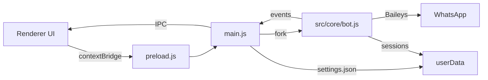

# Arquitetura

Visao tecnica do BotAssist.

## Componentes principais
- `src/main.js`: processo principal do Electron
- `src/preload.js`: bridge segura (contextBridge)
- `src/renderer/*`: UI (HTML/CSS/JS)
- `src/core/bot.js`: processo Node do bot (Baileys + IA)

## Fluxo geral
1. O Electron inicia a UI.
2. O usuario configura a API Key e inicia o bot.
3. O processo `bot.js` conecta ao WhatsApp via Baileys.
4. Mensagens sao processadas e respostas sao geradas com o provedor de IA.

## Diagrama (Mermaid)

## IPC / Eventos
O bot envia eventos para o app via:
- `process.send` (IPC do Node)
- fallback em stdout: `BOTASSIST:{...}`

Principais eventos:
- `qr` (QR Code)
- `status` (online/offline/starting)
- `log` (mensagens para UI)

## Persistencia
As configuracoes ficam em `settings.json` no `userData`.
O historico (memoria) usa uma pasta `sessions` dentro do `userData`.

## Seguranca
As configuracoes sensiveis (API Key) podem ser armazenadas via `keytar`
quando disponivel.
