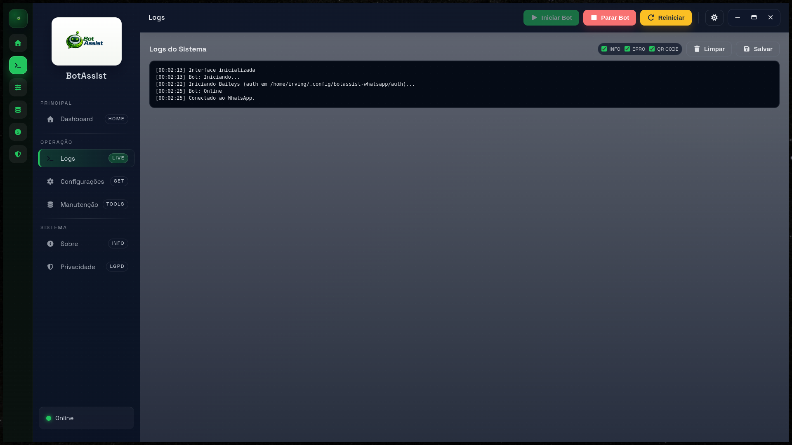

# Ferramentas (tools)

As tools permitem que o bot interaja com web, arquivos, terminal e email.
Elas sao opt-in e ficam desativadas por padrao.

## Como ativar

1. Abra `Configuracoes > Ferramentas (Tools)`.
2. Marque `Ativar ferramentas`.
3. Ajuste seguranca (owner, auto-allow, caminhos, dominios e comandos).
4. Clique em `Salvar`.

## Diagnostico rapido

- `!tools` (DM): mostra status e motivo de bloqueio.
- `!fslist <caminho>` (DM, owner): lista arquivos.
- `!fsread <arquivo>` (DM, owner): le arquivo.
- Se tools estiver bloqueada por owner, configure `ownerNumber`/`ownerJid` no app.

## Fluxo de aprovacao

Quando uma tool nao esta liberada automaticamente:

1. O bot envia solicitacao de aprovacao.
2. O owner responde:
   - `!aprovar <id>`
   - `!negar <id>`
3. O ID vem na propria mensagem de aprovacao enviada pelo bot.

Somente o owner pode aprovar/negar.

## Auto-allow (sem aprovacao)

Por padrao, apenas tools de leitura:
- `web.search`, `web.open`
- `fs.list`, `fs.read`
- `email.read` (se email estiver ativo)

Sempre exigem aprovacao explicita:
- `fs.write`, `fs.delete`, `fs.move`, `fs.copy`
- `shell.exec`

Se quiser aprovacao para tudo: `tools.mode = manual`.

## Busca web

- `web.search` usa DuckDuckGo Instant API.
- `web.open` abre URL e extrai texto.
- `tools.allowedDomains` e `tools.blockedDomains` controlam quais dominios podem ser usados.

Se vier "sem resultados relevantes", revise filtros de dominio e refine a pergunta.

## Caminhos permitidos (arquivos)

- `tools.allowedPaths`: leitura/listagem
- `tools.allowedWritePaths`: escrita/remocao

Validacao usa caminho real (symlink-safe) para evitar escape de allowlist.

Se `allowedPaths` vazio: leitura/listagem usam `~/`.
Se `allowedWritePaths` vazio: escrita/remocao usam os caminhos de leitura.

## Dominios permitidos (web)

- `tools.allowedDomains`: allowlist de dominios
- `tools.blockedDomains`: bloqueio explicito

Se `allowedDomains` vazio, qualquer dominio pode ser usado (menos bloqueados).

## Extensoes e tamanho maximo

- `tools.blockedExtensions`: extensoes proibidas na leitura (ex.: `.exe`, `.dll`)
- `tools.maxFileSizeMb`: limite de tamanho para leitura
- `tools.maxOutputChars`: limite de saida por tool

## Comandos de terminal

- `tools.commandAllowlist`: se preenchido, so executa prefixos permitidos
- `tools.commandDenylist`: bloqueia termos perigosos

## Email (IMAP)

1. Ative Email (IMAP).
2. Configure host/porta/usuario/senha.
3. Defina mailbox (ex.: `INBOX`) e limite.

O bot apenas le emails.

## Auditoria

Cada execucao de tool gera registro em:
- `userData/logs/tools_audit.log`

## Boas praticas

- Teste em ambiente controlado antes de liberar para terceiros.
- Rode com usuario sem sudo.
- Evite liberar caminhos sensiveis.
- Configure owner antes de habilitar tools.
