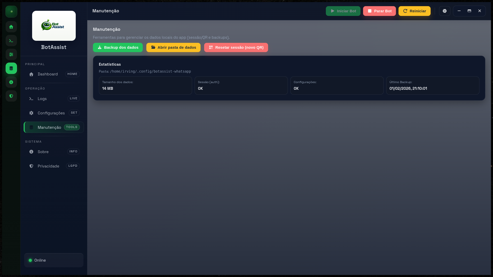
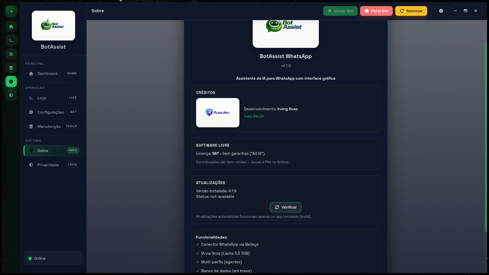

# Troubleshooting

## QR Code nao aparece

- Verifique se o bot foi iniciado.
- Confira a aba de Logs.
- Se necessario, resete a sessao (aba Manutencao).

## Setup inicial nao aparece

Sintoma:

- O app inicia normalmente, mas o assistente de setup nao abre.

Causas comuns:

- API Key e owner ja estao definidos, entao o setup nao e obrigatorio.
- O setup foi fechado anteriormente e voce quer reabrir o assistente.

Como resolver:

- Abra `Configuracoes` e clique em `Abrir Setup Inicial` para reabrir o assistente a qualquer momento.
- Conclua API Key e owner por token: `Configuracoes > Basico > Gerar token` e envie `!owner <token>` no DM.
- Para um reset completo de ambiente, faca backup e limpe a pasta de dados (`auth` e `settings.json`).

## App atualizou, mas a interface parece antiga

Sintoma:

- O app mostra versao nova/status de update, mas a UI nao exibe as mudancas esperadas.

Como validar:

- Abra a tela `Sobre` e confirme a versao instalada.
- Reinicie o app completamente (fechar e abrir de novo).
- Teste uma feature visual da release (ex.: fluxo de owner por token no setup/configuracoes).

Se persistir:

- Reinstale usando o artefato da release correspondente ao seu SO.
- No Linux RPM, confirme que a release publicada contem feed `latest-linux.yml` com `.rpm`.

## Bot conecta mas nao responde

- Confirme API Key da Groq.
- Verifique bloqueio por owner/allowlist.
- Em grupos: o bot precisa de mencao.

## Erro de API Key

- Cole a chave novamente e salve.
- Se usar keytar, reinicie o app.
- Alternativa: `GROQ_API_KEY` no ambiente.

## Nao responde em grupos

- Adicione o JID em `allowedGroups`.
- Mencione o bot na mensagem.
- Se `groupRequireCommand` estiver ativo, use prefixo.

## Ferramentas nao executam

- Verifique `tools.enabled`.
- Verifique owner configurado.
- Se ainda nao houver owner: gere token no app e envie `!owner <token>` no DM.
- Ajuste `allowedPaths`/`allowedWritePaths`.
- Ajuste allowlist/denylist de comandos.
- Teste com o botao `Testar ferramentas`.

## Busca web ruim ou sem relevancia

- Use uma pergunta mais objetiva.
- Verifique se `web.search` esta liberada.
- Revise `tools.allowedDomains`/`tools.blockedDomains`.

## Erro 429 (rate limit)

Sintoma:

- mensagem de limite temporario do modelo/provedor.

Acao:

- aguarde a janela de retry do provedor
- troque para modelo com mais capacidade, se disponivel
- reduza volume de mensagens por segundo

## Email (IMAP) nao funciona

- Confirme host, porta, usuario e senha.
- Verifique se o provedor exige senha de app.
- Teste com `mailbox=INBOX`.

## Build Linux falha no `.deb` com `libcrypt.so.1`

Sintoma comum no Fedora 40+:

- erro no `fpm` com `ruby: error while loading shared libraries: libcrypt.so.1`

Como resolver:

- instale `libxcrypt-compat` no host
- rode o build novamente

Comportamento atual do script:

- `npm run build:linux` tenta gerar `AppImage + .deb`
- se detectar esse erro no host, faz fallback automatico para `AppImage`

Alternativa:

- gerar apenas `AppImage`

## Build Linux `.rpm` falha com `rpmbuild: command not found`

Sintoma:

- erro ao executar `npm run build:linux:rpm`

Como resolver:

- Fedora/RHEL: `sudo dnf install -y rpm-build`
- Debian/Ubuntu (host de build): `sudo apt-get update && sudo apt-get install -y rpm`

## Reiniciar o bot

- Use o botao `Reiniciar`.
- Se travar, pare e inicie novamente.

